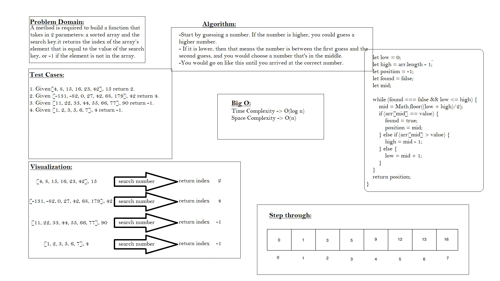

# Binary Search of Sorted Array
Function that takes in 2 parameters: a sorted array and the search key.it returns the index of the array’s element that is equal to the value of the search key, or -1 if the element is not in the array.
## Whiteboard Process

## Approach & Efficiency
#### Requires to sort the array first and is complicated to implement. However, it is efficient even when considering the cost of sorting.
#### time complexity = O(log(n))
#### time complexity = O(n)
