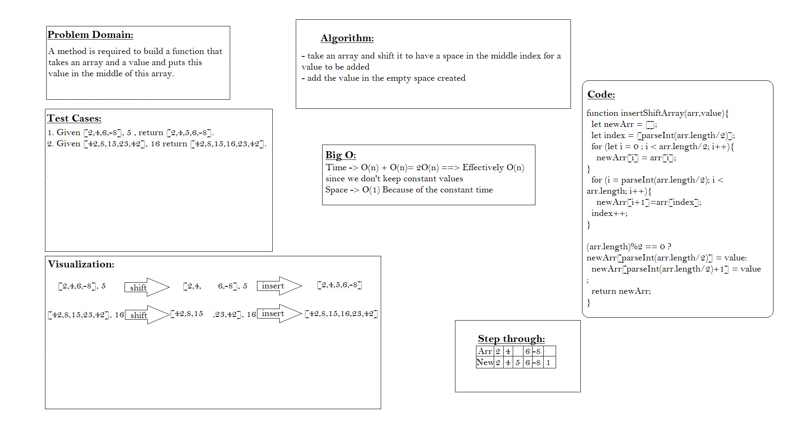

# Insert to Middle of an Array
#### In this challenge, An input numbers of array have to be shifted from the middle of it to add a new value in the empty index made.

## Whiteboard Process

## Approach & Efficiency
Only one approach because time and space big O is optimal.
