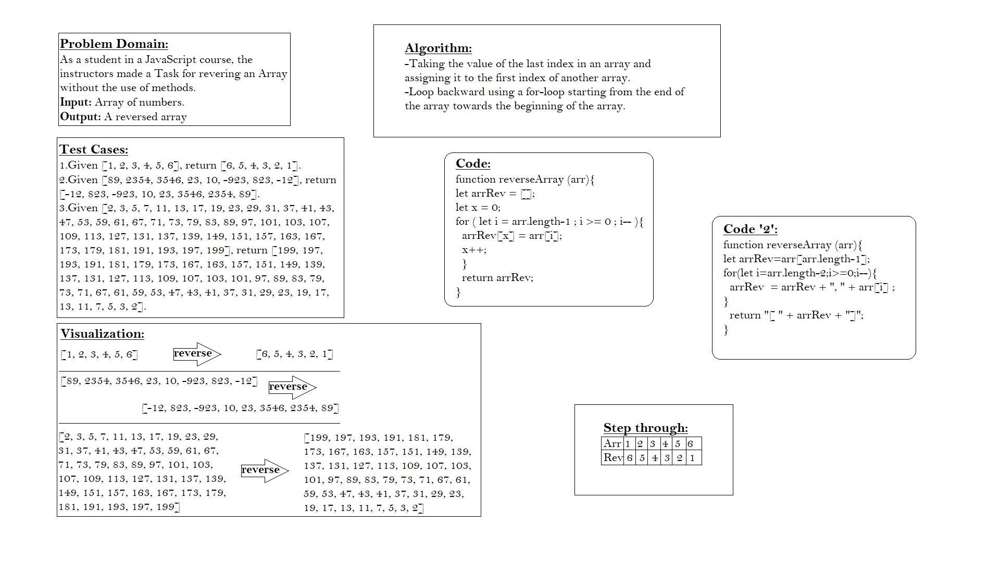

# Reverse an Array
#### In this challenge, An input numbers of array have to be reversed backword.

## Whiteboard Process

## Approach & Efficiency
The first Code is more readable, easier and return an object as the same type of the original array, the second code return a string.
So, my approach is to take the first code.
