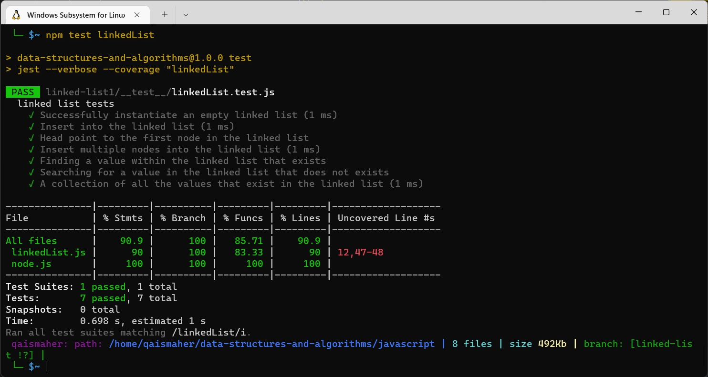

# Singly Linked List
#### Use linked list to efficient insertion and deletion to be used to implement abstract data types.
## Challenge
* Successfully instantiate an empty linked list.
* Insert into the linked list.
* Head point to the first node in the linked list.
* Insert multiple nodes into the linked list.
* Finding a value within the linked list that exists.
* Searching for a value in the linked list that does not exists.
* A collection of all the values that exist in the linked list.
## Test

## Approach & Efficiency
#### Classe is used in linked list to get to O(n) and O(1).
## API
#### Insert: Adds a new node with that value to the head of the list with an O(1) Time performance.
#### Include: Indicates whether that value exists as a Node’s value somewhere within the list.
#### ToString: Returns: a string representing all the values in the Linked List.
