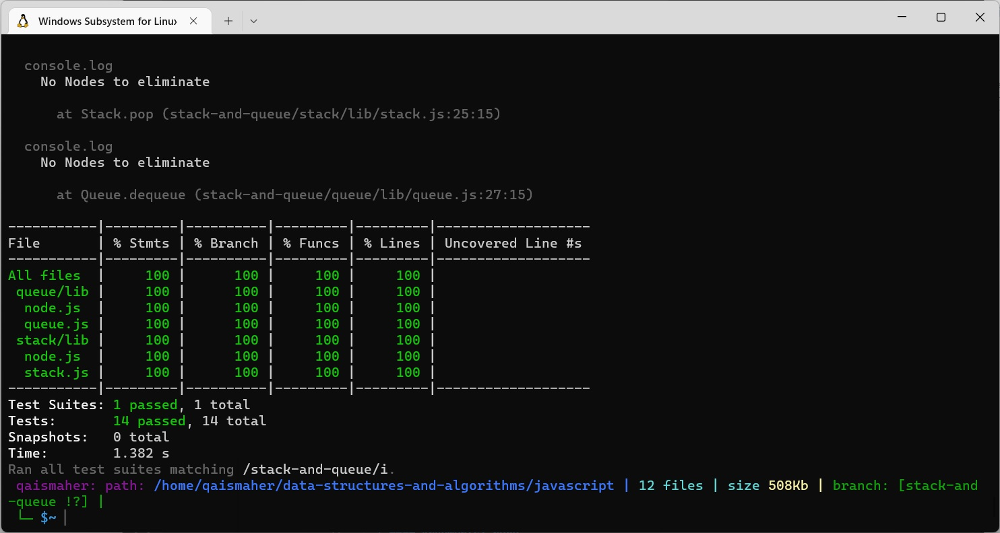

# Stacks and Queues
#### Using a Linked List as the underlying data storage mechanism, implement both a Stack and a Queue

## Challenge
#### Using a Linked List as the underlying data storage mechanism, implement both a Stack and a Queue

### Test

## Approach & Efficiency
#### I have used the node for implementing both stack and queue, it has Big O(1) time and space compexity.

## API
### Stack methods
* #### push
  * #### Arguments: value
  * #### adds a new node with that value to the top of the stack with an O(1) Time performance.
* #### pop
  * #### Arguments: none
  * #### Returns: the value from node from the top of the stack
  * #### Removes the node from the top of the stack
  * #### Should raise exception when called on empty stack
* #### peek
  * #### Arguments: none
  * #### Returns: Value of the node located at the top of the stack
  * #### Should raise exception when called on empty stack
* #### is empty
  * #### Arguments: none
  * #### Returns: Boolean indicating whether or not the stack is empty.
### Queue methods
* #### enqueue
  * #### Arguments: value
  * #### adds a new node with that value to the back of the queue with an O(1) Time performance.
* #### dequeue
  * #### Arguments: none
  * #### Returns: the value from node from the front of the queue
  * #### Removes the node from the front of the queue
  * #### Should raise exception when called on empty queue
* #### peek
  * #### Arguments: none
  * #### Returns: Value of the node located at the front of the queue
  * #### Should raise exception when called on empty stack
* #### is empty
  * #### Arguments: none
  * #### Returns: Boolean indicating whether or not the queue is empty
