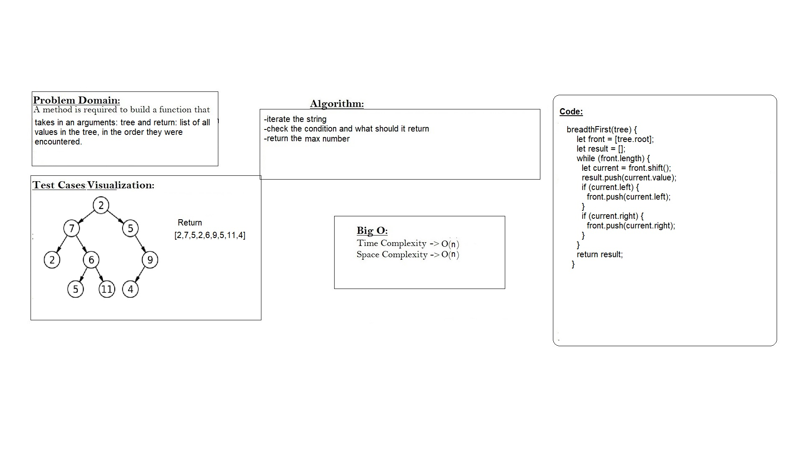

# Tree Breadth first
#### Traverse the input tree using a Breadth-first approach
## Whiteboard Process


## Approach & Efficiency
Big O time and space = O(n)
## Solution
```
breadthFirst(tree) {
    let front = [tree.root];
    let result = [];
    while (front.length) {
      let current = front.shift();
      result.push(current.value);
      if (current.left) {
        front.push(current.left);
      }
      if (current.right) {
        front.push(current.right);
      }
    }
    return result;
  }
