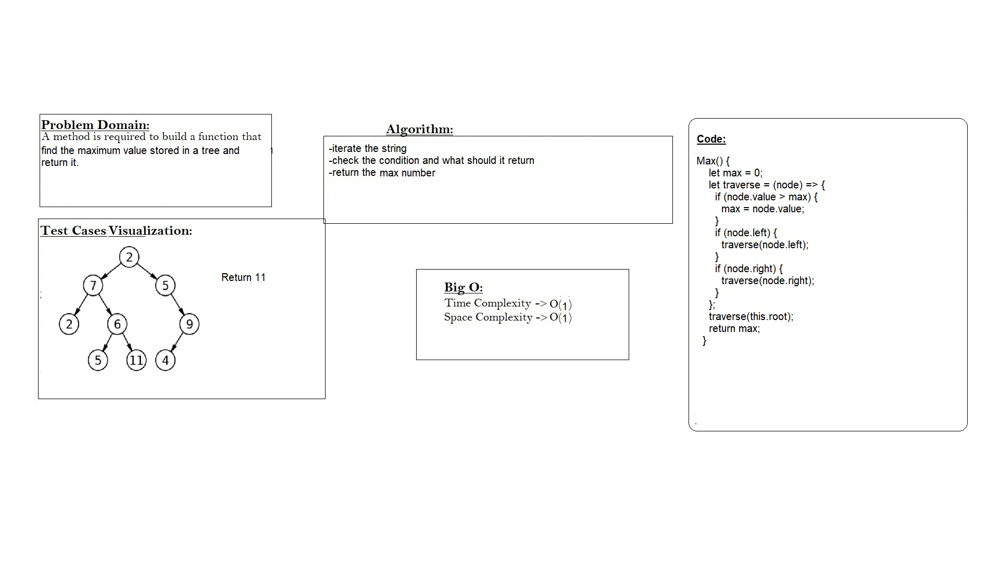

# Tree Max
#### Find the Maximum Value in a Binary Tree
## Whiteboard Process


## Approach & Efficiency
Node approach with big O time and space = O(1)
## Solution
```
Max() {
    let max = 0;
    let traverse = (node) => {
      if (node.value > max) {
        max = node.value;
      }
      if (node.left) {
        traverse(node.left);
      }
      if (node.right) {
        traverse(node.right);
      }
    };
    traverse(this.root);
    return max;
  }
